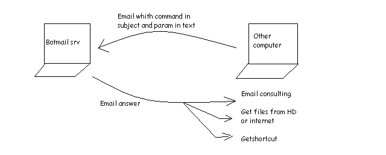



## Botmail 1\.0 \- the ultimate bot for PC

### Description

The ultimate bot for your PC!!!! (vote for me please -> what do you of this??? bug??? give

me idea for new version)

This program allow you to get files and email from a computer where this prog is installed

I am at work and i've got email but not internet access , no floppy or cd drive ...

I make this bot to execute some command on my computer at home (DSL connnected)

So i can get from my work (or anywhere ex: friend , cybercafe -> yahoomail etc... ) some files from my

hard drive or from internet

i can consult my home email from an other computer that have email or internet access

you can disable some command just by modifying .ini file

How to use botmail???

it's very simple look at docu.txt
 
### More Info
 

             |
---                |---
**Submitted On**   |2002-10-29 16:04:10
**By**             |[coeyman](https://github.com/Planet-Source-Code/PSCIndex/blob/master/ByAuthor/coeyman.md)
**Level**          |Advanced
**User Rating**    |4.8 (43 globes from 9 users)
**Compatibility**  |VB 4\.0 \(32\-bit\), VB 5\.0, VB 6\.0
**Category**       |[Complete Applications](https://github.com/Planet-Source-Code/PSCIndex/blob/master/ByCategory/complete-applications__1-27.md)
**World**          |[Visual Basic](https://github.com/Planet-Source-Code/PSCIndex/blob/master/ByWorld/visual-basic.md)
**Archive File**   |[Botmail\_1\_1491681142002\.zip](https://github.com/Planet-Source-Code/coeyman-botmail-1-0-the-ultimate-bot-for-pc__1-40395/archive/master.zip)

